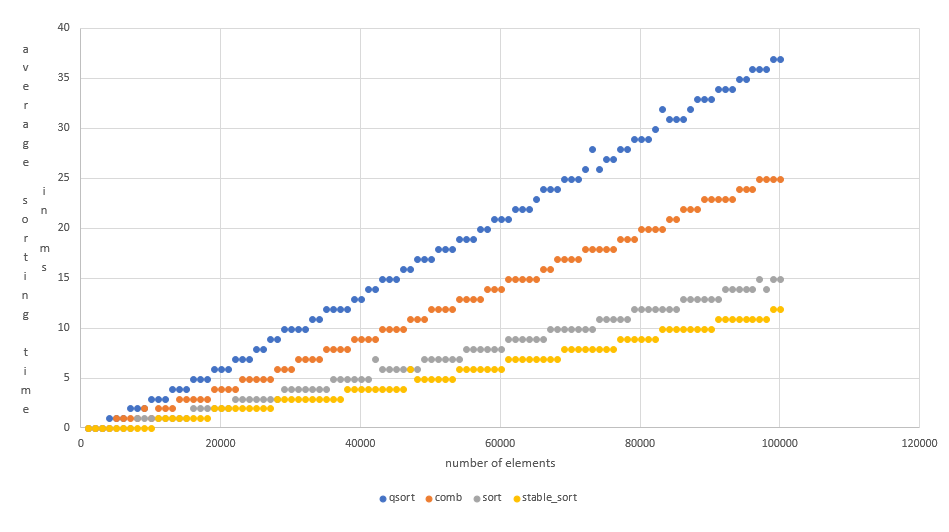

# Speed test of sorting algorithms

The program compares the average time (seven measurements) of each of the tested sorts. It creates four files with sorting time in milliseconds for each tested number of elements in the array (std :: vector).<br>
The initial number of the elements: 1000<br>
The final number of the elements: 100,000<br>
Step: 1000

Sorting algorithms
-
- qsort
- std::sort
- std::stable_sort
- comb_sort

Compile
-
```
$ g++ -std=c++11 main.cpp -O3
```

Run
-
 Windows:
 `$ ./a`<br>
 Linux: `$ ./a.out`


My resulting graph
-

</img>


